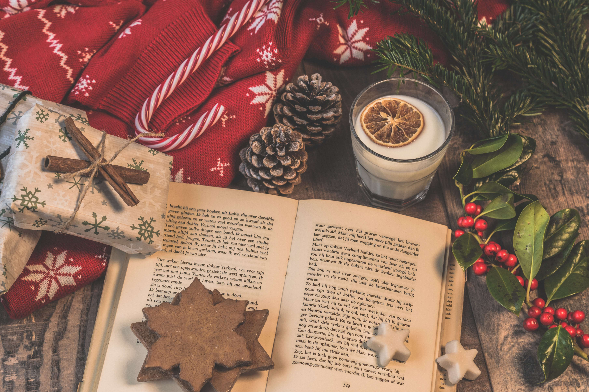

# Secret Santa: rules of the game


  
> - 📩 If the rules aren't clear, please email me to verify.
>   - You can find **my email in your dashboard**.
> - ⛪ If you're a member of the church, it's likely we'll give gifts in-person on Christmas Eve :)
> - 🇬🇧 It doesn't make sense to add international gift buyers right now, so **it's UK only please**.


## ⏰ Deadline

- The Secret Santa draw will be held on **December the 18th**
- The [last chance](https://www.royalmail.com/christmas/last-posting-dates) to post your gift will be on **Wednesday 20 December**
- That should give you **two days** to buy your gift.

&nbsp;
<hr />

- [x] 🔒 **We care about privacy.** Personal details are only used for the Secret Santa;[^1]
  - your buyer will only see your name, address and your wishlist.
- [x] 📖 Your data will be deleted after the Secret Santa
  - I may hold on to your email to let you know about future plans in the world of books!

&nbsp;

## Which option did you pick?

- [ ] 🎁 [Gift option 1](#-gift-option-1-2nd-hand-books):  One **2nd hand book** (in great condition)
- [ ] 🎁 [Gift option 2](#-gift-option-2-a-sparkling-new-book):  A **sparkling new book** of your choice
    - [ ] 👨‍👩‍👧‍👦 [I have a child](#-if-you-have-children-who-are-joining-in) in who'd like to join

## What happens after the draw?

You'll get a message to find out more about your Secret Santa, and [then you'll post (and buy) the book](#-posting-the-book) depending on your choice. If for some reason you're unable to physically buy a book, I might be able to do it on your behalf (requires payment, so email me).

&nbsp;

### 🎁 Gift option 1: 2nd hand books

> **Book quality:** imagine you're giving a book away; will you regret it? If the answer is "yes", it's probably a great gift to give someone, as it has some emotional meaning to you.

For 2nd hand books, **let's stick to fiction or autobiography** so we all get something we like. Your Secret Santa will have chosen one or the other option. We'll match you with another person who's also selected the 2nd hand book option. The 2nd hand book should be of good quality: not damaged, and something that you really loved reading. It's a gift, so a good chance to share a book that's really been valuable to you, and you're passing that down to someone else.


### 🎁 Gift option 2: A sparkling new book

> **Book picker:** Your Secret Santa has given you a hint, or is leaving the choice up to you. Make it a good one!

**Your Secret Santa has given you a selection of books to choose from**, so they get something they'll enjoy. There's also a little sense of excitement at receiving a book but not knowing which one you're going to get! Choose one at random, or choose their 1st choice .. I'll leave that decision up to the buyer.

**If your chosen person has decided to be surprised**, they're leaving the choice of book up to you ... if they've given you a genre suggestion, then stick to that. If they've left the choice up to the gods, the world's your oyster: head to Waterstones, or your local book shop and ask for a recommendation; use Google or Amazon to look for the "best new books of 2023"; pick a classic; or simply choose a book you really loved to read.


### 👨‍👩‍👧‍👦 If you have children who are joining in

> Every Secret Santa applicant must provide one book per entry. We're keeping the kids section as **option 2 only** due to the age range of our Secret Santa group, which will make sure they'll all get something they love.

Parents can submit one child per entrant, but can **get in touch by email** if you have lots of kids eager to take part. Parent's will be responsible for payment of books, and will be asked to match like-for-like. This means, if yourself and your child are taking part, **that's two books** we'd like you to offer others in the Secret Santa; e.g: if you opt for a sparkling new book, it'll be £14 per book.

For every kid who takes part, that's another book to buy.[^3] 

## 📮 Posting the book

> - For **option 1** all it's going to cost you is postage.
> - For **option 2** you'll pay for the book and postage.

**There's a cap on spending to <ins>£14 per book</ins>** per person. This should pay for a great paperback book, and about £3.70 postage cost with Royal Mail. If you're buying through Amazon, you can post it as a gift:

First off, it's a gift — so make it look like one! How about adding a nice Christmassy note? Or a card? If it's a 2nd hand book, you could even tell your Secret Santa why you picked it.

**My preference would be to shop with Waterstones, or your local book shop if you can.**

```
To send a book as a gift on Amazon UK, follow these steps:

1. Go to the product detail page of the book you want to gift.
2. Click on the "Add to Basket" button.
3. Check the box that says "This order contains a gift".
4. Click on the "Proceed to Checkout" button.
5. Select the delivery address or add a new one.
6. Click on the "Add gift options" button.
7. Include a free gift message.
8. Click on the "Place your order" button.

You can choose from a wide selection of books and send them as gifts to your loved ones. You can also include a personalized message with your gift.

I hope this helps! Let me know if you have any other questions.

Source: Conversation with Bing, 11/12/2023
(1) Amazon.co.uk: Gift a Kindle Book: Kindle Store. https://www.amazon.co.uk/b?node=16105196031.
(2) Send a Gift - Amazon Customer Service. https://website-g7g.amazon.co.uk/gp/help/customer/display.html?nodeId=GSBVPNCXBREXPVA6.
(3) Redeem a Kindle Book Gift - Amazon Customer Service. https://arcus-www.amazon.co.uk/gp/help/customer/display.html?nodeId=GW5P2J5UV6EHRZCL.
(4) Amazon UK now enables you to gift Kindle books - Pocket-lint. https://www.pocket-lint.com/apps/news/amazon/107114-amazon-gift-kindle-books/.
(5) How to Gift a Kindle Book: Everything You Need to Know. https://bonafidebookworm.com/how-to-gift-a-kindle-book/.
```

[^1]: **🎅 After the draw:** You will be sent details of your Secret Santa, along with their wishlist. Every applicant needs to supply their address, which will be sent to your buyer, and your phone number, which will be used internally to notify you of your Secret Santa and the deadline.

[^2]: If you're too busy, or running short in time, please email me to send the money along and I'll try to buy it on your behalf. (I'll add a PayPal link soon)

[^3]: **If you've chosen kids** option, and you're also entering yourself, there's a small chance our random draw will match one of your kids with you. I think this is unlikely to happen, so we'll aim to make sure you both get one of the other Secret Santa's to give a gift to!


